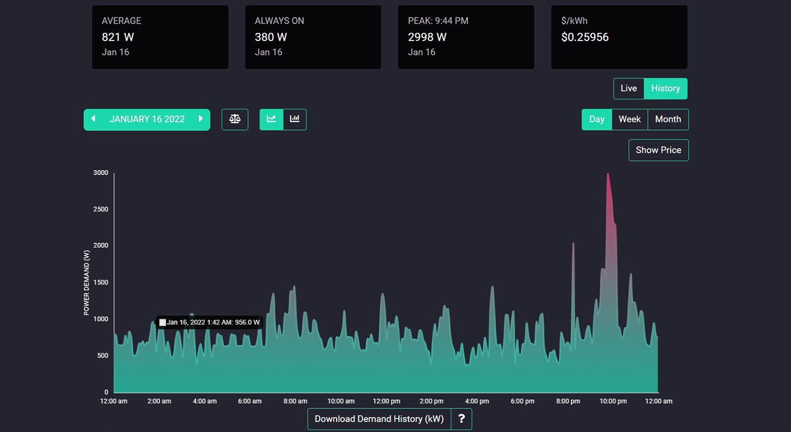
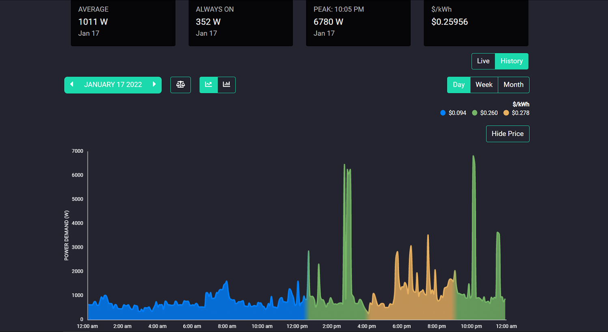
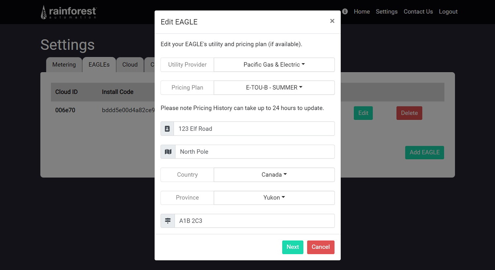
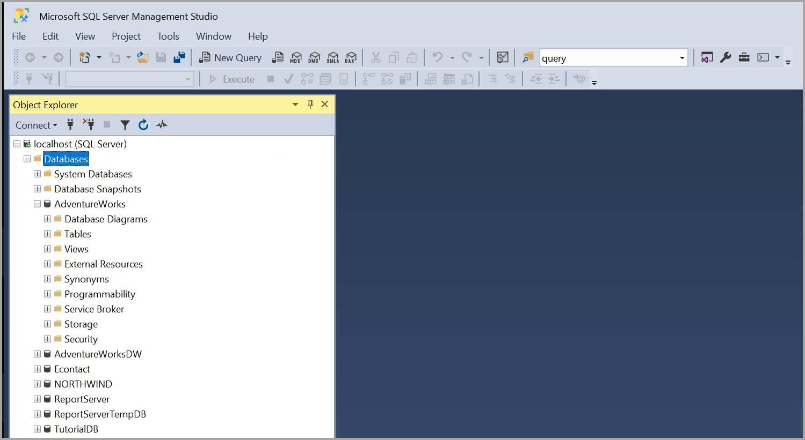

#  Work Samples
## Government of Canada

### Designed and deployed a responsive GIS web map parameters menu controlling data layers and map filters
 

### Developed the database tabs and filtering feature handling Esquimalt Graving Dock billing transactions
 

## Rainforest Automation Inc

### Reduced the demand history graph's render time by 80% from 5s to 1s by implementing Redux caching
 

### Implemented the pricing graph feature using Canvas API and optimized JSON history using Redux states
 

### Optimized the weekly demand history graph's render time by 50% by plotting 60m intervals instead of 15m
 

### Devloped the Edit Device Modal thats configues device information and POST API request to cloud DB
 

### Updated, troubleshooted, and reprogrammed UNIX firmware using Bash scripts and XML commands
 

## Prococious Technology Inc

### Maintained, debugged and applied schema updates to SQL Servers using SQL Server Management Studio